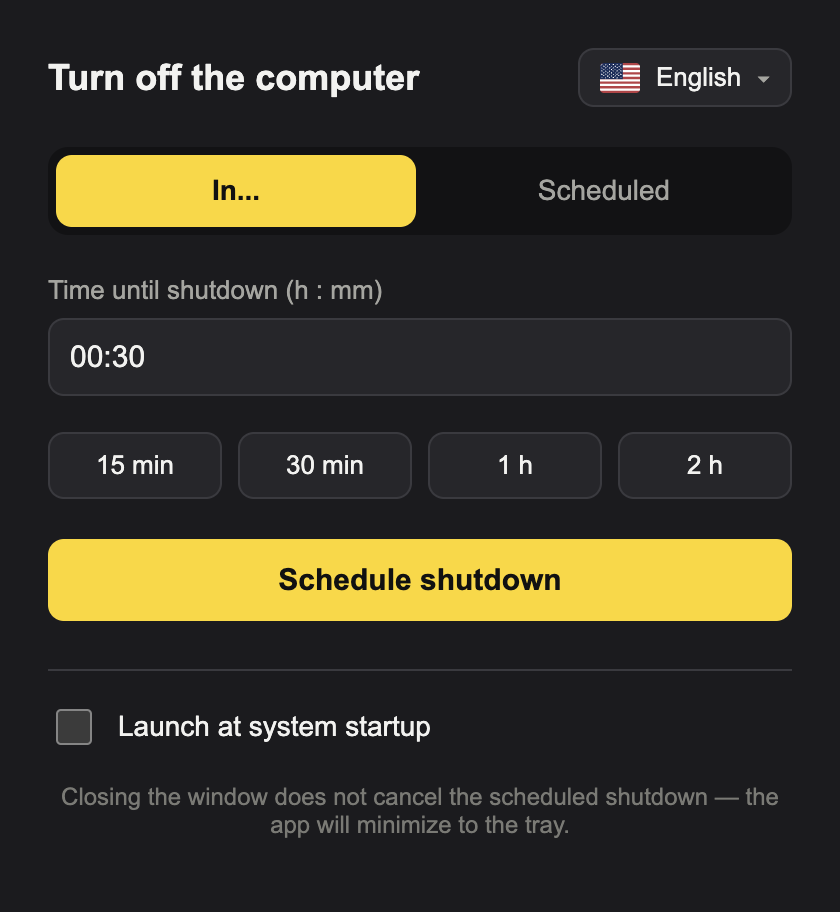
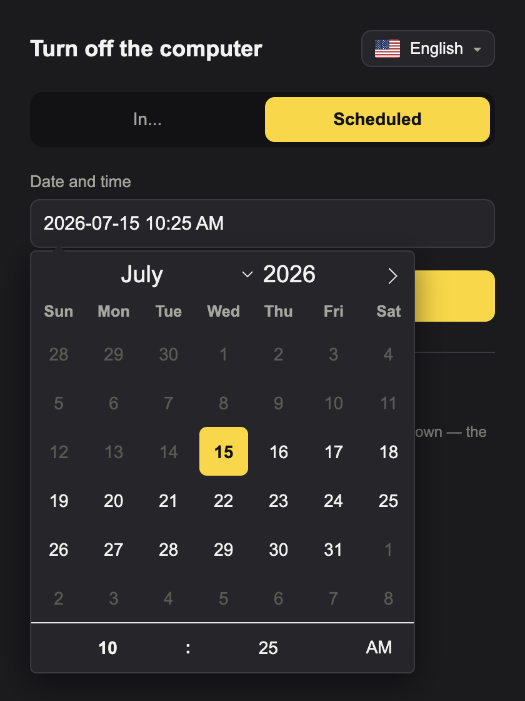
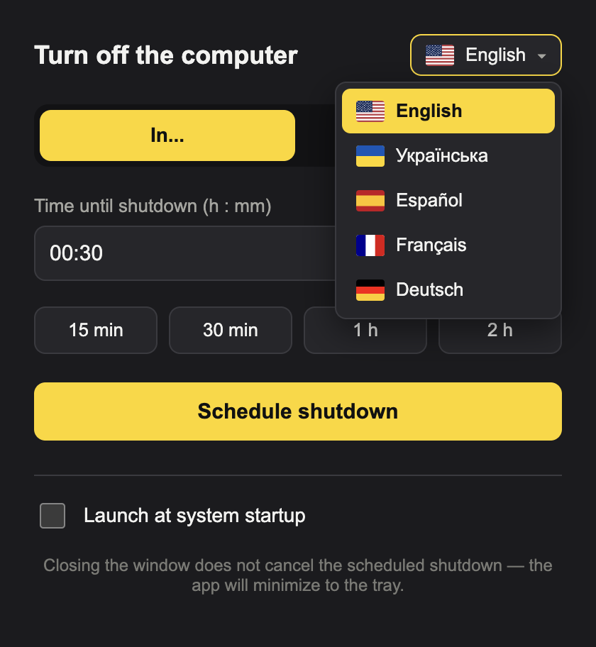
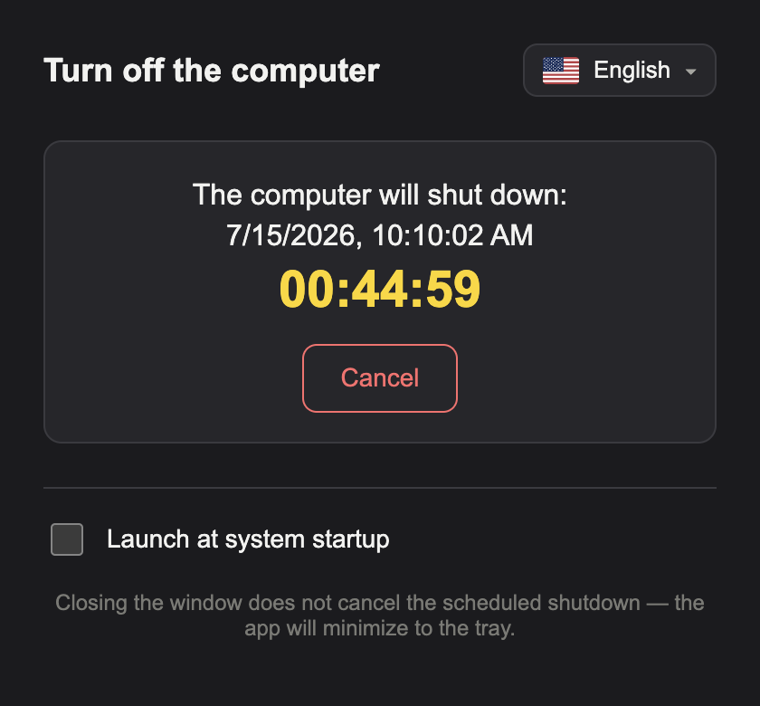

# PowerDown

**[powerdown.app](https://powerdown.app)**

A small, cross-platform Electron app that shuts your computer down on a timer or at a scheduled date and time.

- **In…** — set hours/minutes (or tap 15 min / 30 min / 1 h / 2 h) and the computer shuts down after that time.
- **Scheduled** — pick a date and time on the calendar, and it shuts down exactly then.

Works on **Windows, macOS, and Linux** — the app picks the right shutdown command for the current platform automatically. While a shutdown is pending it keeps running in the tray, and a live countdown shows how long is left (with a **Cancel** button).

## Screenshots

<table>
  <tr>
    <td align="center">
      <br />
      <sub>Countdown timer</sub>
    </td>
    <td align="center">
      <br />
      <sub>Schedule a date &amp; time</sub>
    </td>
  </tr>
  <tr>
    <td align="center">
      <br />
      <sub>Five languages, with flags</sub>
    </td>
    <td align="center">
      <br />
      <sub>Live countdown while pending</sub>
    </td>
  </tr>
</table>

## Features

- **Two modes** — a countdown timer and a calendar-based scheduler.
- **Cross-platform** shutdown (Windows / macOS / Linux).
- **Five interface languages** — English, Ukrainian, Spanish, French, German — with flag icons. First run follows your OS language (falling back to English); your choice is remembered.
- **Locale-aware clock** — the scheduled time uses 12-hour AM/PM or 24-hour, per locale.
- **Launch at system startup** — optional, toggled in the app.
- **Tray + live countdown** — closing the window keeps the shutdown pending; cancel any time.

## Download

Pre-built installers for Windows, macOS, and Linux are on **[powerdown.app](https://powerdown.app)** or directly on the [releases page](https://github.com/Richard-bahrii/PowerDown/releases/latest). Builds are unsigned — macOS and Windows will warn about an unidentified developer on first launch.

## Run in development

```bash
npm install
npm start        # compiles TypeScript, then launches Electron
```

The source is TypeScript under `src/` (`main`, `preload`, `renderer`), compiled to `dist/` with `tsc` — no bundler. Use `npm run watch` for incremental recompiles.

## Build an installer

```bash
npm run dist:win     # Windows (.exe, NSIS)
npm run dist:mac     # macOS (.dmg)
npm run dist:linux   # Linux (AppImage + .deb)
```

Built files land in the `release/` folder. Cross-building (e.g. an `.exe` on a Mac) only partly works — it's more reliable to build each target on its own OS or in CI.

## How it works

- While a shutdown is scheduled, the app keeps running in the background (tray icon). Closing the window only hides it — the shutdown still happens. Use **Quit** in the tray menu to fully stop the app.
- At the target time, it runs a native command:
  - **Windows:** `shutdown /s /f /t 0`
  - **macOS:** the AppleScript `tell application "System Events" to shut down` (macOS asks for permission to control the system on first run — you need to grant it)
  - **Linux:** `systemctl poweroff` (falling back to `loginctl poweroff` / `shutdown -h now`)
